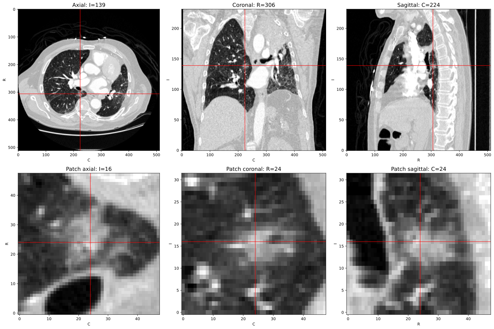
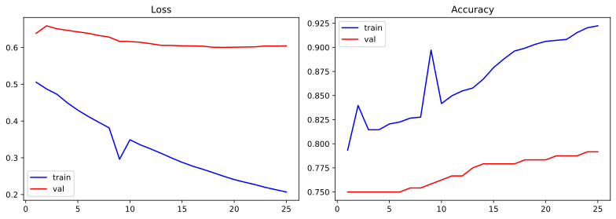
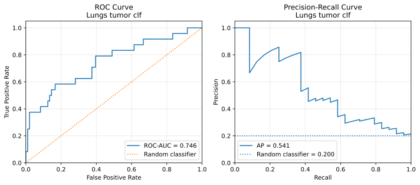

# Lung tumor detection

The project is devoted to the lungs tumor detection on computer tomography images using custom deep learning algorithm.

Recent advancemet in machine learning machine learning made a substantial progress in various domains of medicine. In particular, automated scanning of medical images  done with new algorithms and image processing techniques has inceased the precision of lung tumor detection. As a result, patients can be provided with more accurate diagnoses on earlier stages, and this decreases in general the mortality rate from that disease.

In the last decade, a large online-competition devoted to the lung tumor, [LUng Nodule Analysis (LUNA) 2016](https://luna16.grand-challenge.org/Data/), opened a new perspective for AI-assisted medical research. Desite the fact the event was finished, its data is still publicly available and worth to analyze due to several reasons. On first, the original dataset contains 888 raw Computer Tomography (CT) images whose total size exceeds 100 Gigabytes. Such a large amount of raw data gives a great opportunity for medical data analysts. On second, authors of the competition provided participants with two additional datasets: first contains over 700,000 nodule candidates, and the second consist of about 1550 verified tumors. These circumstances made this data a valuable asset.

## Data preparation 

Due to the large number of files and complexity of their handling, the data preprocessing was carried out in several stages. The preparation starts from reading two distinct .csv files that contain nodule specifications. The file `candidates.csv` contains spatial coordinates of all suspicious nodule candidates' centers, but lack their sizes. Luckily, these dimensions could be retrieved from another file, `annotations.csv`, containig all tumor-class nodules, which were manually proven by certified CT-analysts. Following reading, positive nodule candidates are augmented with nodule diameters, whereas those of the negative class are filled with zeros.

A huge volume of raw data forced the competition organizers to split CT files by archived subsets. On the following step of preprocessing pipeline, these files must be unziped. Notably, each CT consist of two files: a header file with some technical information, and a CT-image having *.mhd* and *.raw* extensions respectively. Next, we must filter nodule candidates, whose images exist in the data directory. Such selection allows to minimize the amount of raw data for our study.

Reading of a CT image outputs body slices shown on the Fig.1. Every image displays an annotated lung tumor nodules on three projection: axial, coronal sagital.

   

Fig. 1 - CT slice samples

## Methods

## Results

  

Fig. 2 - Training progress

  

Fig. 3 - Classificaiton metrics
