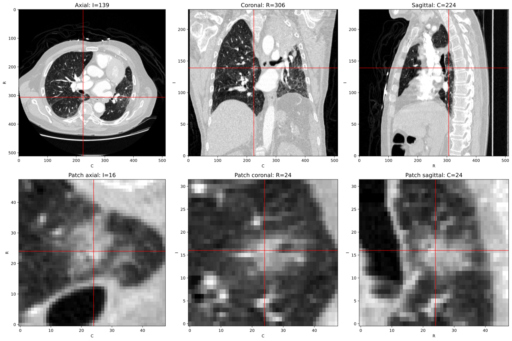
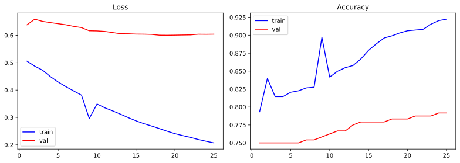
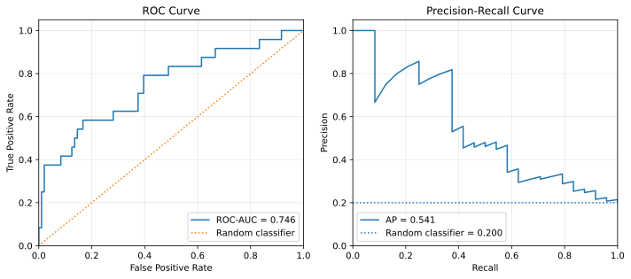

# Lung tumor detection

The project is devoted to the lungs tumor detection on computer tomography images using custom deep learning algorithm.

## Content

* [Introduction](README.md#Introduction)  
* [Data preparation](README.md#Data-preparation)  
* [Methods](README.md#Methods)
* [Results](README.md#Results)                    

---
## Introduction

Recent advancemet in machine learning machine learning made a substantial progress in various domains of medicine. In particular, automated scanning of medical images  done with new algorithms and image processing techniques has inceased the precision of lung tumor detection. As a result, patients can be provided with more accurate diagnoses on earlier stages, and this decreases in general the mortality rate from that disease.

In the last decade, a large online-competition devoted to the lung tumor, [LUng Nodule Analysis (LUNA) 2016](https://luna16.grand-challenge.org/Data/), opened a new perspective for AI-assisted medical research. Desite the fact the event was finished, its data is still publicly available and worth to analyze due to several reasons. On first, the original dataset contains 888 raw Computer Tomography (CT) images. Such a large number of raw CTs provides medical data analysts with a great opportunity for research. On second, authors of the competition provided participants with two additional datasets: first contains over 700,000 nodule candidates, and the second consist of about 1550 verified tumors. These circumstances made this data a valuable asset.

## Data preparation 

Due to the complexity of CT-images handling, their preprocessing was carried out in stages. The preparation starts from reading two distinct .csv files that contain nodule specifications. The file `candidates.csv` contains spatial coordinates of all suspicious nodule candidates' centers, but lack their sizes. Luckily, these dimensions could be retrieved from another file, `annotations.csv`, containig all tumor-class nodules, which were manually proven by certified CT-analysts. Following reading, positive nodule candidates are augmented with nodule diameters, whereas those of the negative class are filled with zeros.

On the following step of preprocessing pipeline, archives with raw CT images were unziped. Notably, each CT consist of two files: a header file with some technical information, and a CT-image having *.mhd* and *.raw* extensions respectively. Next, we filtered nodule candidates, whose images exist in the data directory. Such selection allows to minimize the amount of raw data for our study.

Reading of a CT image outputs body slices shown on the Fig.1. Every image displays an annotated lung tumor nodules on three projection: axial, coronal sagital.

   

<i>Fig. 1 - CT slice samples</i>

## Methods

One of the main hurdle, which slows every stage of this project, is a huge amount of raw data. This circumstance forces us to apply various techniques to increase the processing speed. On first, the total size of CT images exceeds 100 Gigabytes, and it requires a substantial disk space. Though tomographies were provided in archived subsets, they need to be unziped because the CT-reading package, *SimpleITK*, cannot access archives. To our knowledge, there are no cloud services that could process such a large data chunks for free. So, our home computers was a single available option. On second, large file size makes impossible their import to the RAM for caching. Instead, reading is carried out sequentially, e.g. file by file. On third, model training and validation may take dosens of minutes if performed on a CPU of a modern computer. To increase the computation speed, we used a GPU unit (CUDA technology) to train models.

In this study, our goal is to construct a precise and robust tumor detecting algorithm. To reach this, we carried out several experiments, comparing different data preprocessing pipelines and models to identify better strategy for our binary classification problem.

All models were benchmarked by several metrics such as Accuracy, Recall, and F1-score.
## Results

### 1. Luna model

One of the main goals of the first experiment was to constuct working data processing pipeline and test the model. So we decided to compose a dataset from all available tumor-class candidates and nodules (negative class) in a ratio of about 1:2 respectively. As a result, the total number of studying instances reached about 4650 instances. Such l

  

<i>Fig. 2 - Training progress</i>

The LUNA model showed satisfactory results, though its tumor-detecting power is low as shown in the Table 1. The Recall score is a tiny  

              precision    recall  f1-score   support

  Non-nodule     0.7434    1.0000    0.8528        84
      Nodule     1.0000    0.1944    0.3256        36

    accuracy                         0.7583       120
   macro avg     0.8717    0.5972    0.5892       120
weighted avg     0.8204    0.7583    0.6946       120 

  

<i>Fig. 3 - Classificaiton metrics</i>
