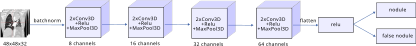
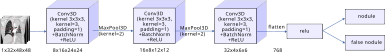

# Lung tumor detection

This project is devoted to lung tumor detection in computed tomography (CT) images using a custom deep learning algorithm.

## Content

* [Introduction](README.md#Introduction)  
* [Data preparation](README.md#Data-preparation)  
* [Methods](README.md#Methods)
* [Results](README.md#Results)                    

---
## Introduction

Recent advances in machine learning have led to substantial progress in various areas of medicine. In particular, an AI-assisted analysis of medical images using modern algorithms and image-processing techniques has improved the accuracy of lung nodule detection. As a result, patients can potentially receive more accurate diagnoses at earlier stages, which may contribute to reducing mortality associated with lung cancer.

In the last decade, the [LUng Nodule Analysis (LUNA) 2016](https://luna16.grand-challenge.org/Data/) competition provided a valuable benchmark for research in automated lung nodule detection. Although the competition has ended, its dataset remains publicly available and provides a valuable resource for further research for several reasons.

First, the original dataset contains 888 raw CT scans. This large collection of medical images provides researchers with an opportunity to investigate various approaches to automated lung nodule detection. Second, the competition organizers provided two additional datasets: one containing more than 700,000 nodule candidates (e.g. negative class) and another containing approximately 1,550 manually annotated nodules (e.g. positive class). These characteristics make the LUNA16 dataset a valuable resource for developing and evaluating machine learning methods for lung nodule detection.

## Data preparation 

Due to the complexity of CT-image processing, data preprocessing was performed in several stages. The preparation begins with reading two distinct *.csv* files containing information about nodule candidates. The `candidates.csv` file contains the spatial coordinates of the centers of suspicious nodule candidates but does not provide their diameters. These dimensions can be retrieved from another file, `annotations.csv`, which contains manually verified nodules identified by experienced CT analysts. After reading both files, positive nodule candidates are augmented with the corresponding nodule diameters, whereas candidates belonging to the negative class are assigned a diameter of zero.

In the next step of the preprocessing pipeline, the archives containing the raw CT images are extracted. Each CT scan consists of two files: a header file containing technical and spatial information and a raw image file, with *.mhd* and *.raw* extensions, respectively. We then filter the nodule candidates to retain only those whose corresponding CT images are available in the data directory. This selection reduces the amount of raw data that needs to be processed during the study.

Reading a CT scan produces a three-dimensional volume consisting of multiple body slices. Figure 1 illustrates the visualization of an annotated lung nodule using three orthogonal projections: axial, coronal, and sagittal.

   

<i>Fig. 1 - CT slice samples</i>

## Methods

One of the main challenges throughout this project is the large volume of raw data, which affects virtually every stage of the processing pipeline. Therefore, several techniques were employed to improve processing efficiency.

First, the total size of the CT dataset exceeds 100 GB, requiring substantial disk space. Although the CT scans were provided in archived subsets, they have to be extracted because *SimpleITK*, a CT-reading library, cannot directly process the images while they remain inside the archives. Due to the large size of the dataset and the limitations of available computational resources, the experiments were performed on local computers.

Second, the large size of individual CT volumes makes it impractical to load the entire dataset into RAM for persistent caching. Instead, CT scans are loaded sequentially as needed during data processing.

Third, model training and validation can take tens of minutes when performed on a modern CPU. To reduce computation time, a GPU was used for model training through the CUDA platform.

The main goal of this study is to develop an accurate and robust lung tumor detection algorithm. To achieve this objective, several experiments were conducted to compare different data-preprocessing approaches and model configurations and to investigate their suitability for the binary classification task.

To ensure results compability of across multiple experiments, we used following method. All models were trained for 25 epochs only, and the learning rate value was set at 0.001. The *Cross-entropy loss* was used as the optimization criterion for the two-class classification problem:

$$Loss = -[y \cdot \log(\hat{y}) + (1-y) \cdot \log(1- \hat{y}) ]$$

In addition, we evaluated model performance using several classification metrics, including accuracy, precision, recall, and F1-score.

## Results

### Experiment 1.

One of the main goals of the first experiment was to construct a functional data-processing pipeline and establish a baseline model. To implement this idea, two steps have been made. On first, the number of CT was limited to apporoximately 250 images. Such a reduced number of CTs ensured that the training time for our model was about 20 minutes, and we were able to catch possible errors faster. On second, our dataset was composed using all available tumor-class candidates and approximately twice as many negative-class candidates, resulting in a negative-to-positive ratio of approximately 2:1. The resulting dataset contained approximately 4,650 candidate samples.

Although this dataset is sufficient for testing the processing pipeline and establishing a baseline, its size is relatively small for training a robust deep learning model.

The machine learning architecture used in this experiment is relatively simple. It consists of four sequential 3D convolutional blocks followed by a fully connected classification layer, as illustrated in Figure 2. Each convolutional block contains two 3D convolutional layers, ReLU activations, and a 3D max-pooling layer. The number of feature channels increases progressively through the network.

  

<i>Fig. 2 - Architecture of the Lunamodel</i>

As expected, the baseline LUNA model demonstrated limited performance in detecting nodules. In particular, the recall for the Nodule class was only 0.194, as shown in Table 1. This means that the model correctly identified approximately 19% of the actual nodules in the evaluation set, while the remaining nodules were classified as non-nodules. Missing a positive nodule, however, is quite important here.

| Metric             | Experiment 1 | Experiment 2 | Experiment 3 |
| ------------------ | -----------: | -----------: | -----------: |
| Test samples       |          120 |          262 |          262 |
| Non-nodule samples |           84 |          131 |          131 |
| Nodule samples     |           36 |          131 |          131 |
| **Accuracy**       |   **0.7583** |       0.7252 |       0.7252 |
| Nodule precision   |   **1.0000** |       0.7611 |       0.7153 |
| **Nodule recall**  |       0.1944 |       0.6565 |   **0.7481** |
| Nodule F1          |       0.3256 |       0.7049 |   **0.7313** |
| Macro F1           |       0.5892 |       0.7239 |   **0.7250** |
| Weighted F1        |       0.6946 |       0.7239 |   **0.7250** |

<i>Table 1 - classification report of all experiments</i>

The F1-score for the Nodule class was 0.3256, reflecting the imbalance between its perfect precision (1.000) and very low recall (0.1944). Thus, the first experiment demonstrates that the baseline architecture and preprocessing pipeline require further improvement before the model can be considered suitable for reliable lung nodule detection. 

### Experiment 2. Luna model with balanced class ratio 

In this experiment, several techniques were applied to imprpove the model quality. Having test the trainig pipeline, we trained our model on all available images. As a result, its recall score has almost trippled, and grew from 0.1944 to 0.6565 as shown in the Table 1.

### Experiment 3. Luna model 2 with image augmentation

In this experiment, we tried to improve accuracy of our model even further using an improved layer composition, and image augmentation. To increase the the model's generalizing capability, we put a BatchNormalization layer after every Convolutional layer. The total number of Convolutional3d blocks was reduced from for to three as displayed on the Fig. 3.

  

<i>Fig. 3 - Architecture of the Lunamodel2</i>

 Secondly, we also augmented images using various techniques.  
